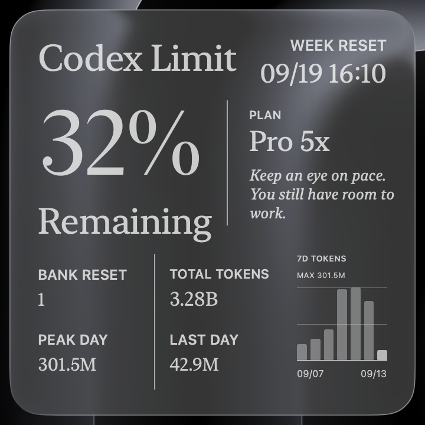
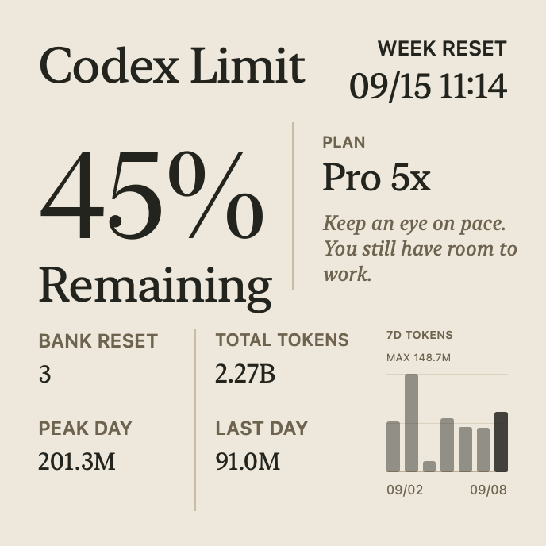

# Codex Limit Widget · Custom Edition

给 Codex 额度小组件增加日期、banked reset 次数和 7 日 Token 图，并重新整理大号 Beige 布局。

A personal customization of [sergeylopukhov/codex-limit-widget](https://github.com/sergeylopukhov/codex-limit-widget), based on **v1.2.304**. Original app and visual design by Sergey Lopukhov; custom data fields and layout refinements maintained by [carey-bk](https://github.com/carey-bk). Not an official OpenAI application.

**[下载定制版 DMG / Download](https://github.com/carey-bk/codex-limit-widget/releases/latest)** · [原版说明 / Upstream README](README.upstream.md) · [构建说明](LOCAL-CHANGES.md)

## 实机效果

当前定制版在 macOS 桌面上的玻璃效果。画面中的额度和统计来自截图当天，仅作展示。

第二档提示文字的布局预览

下图是此前用于验证长文案的 **45% 模拟预览**，不是账户实时额度。预览为不透明底色，且生成于最后几次间距微调之前；最终桌面外观以上方实机图为准。

## 定制内容

- **重置日期**：时间旁补上月/日，跨年时包含年份。
- **套餐名称**：`prolite → Pro 5x`、`pro → Pro 20x`、`plus → Plus`；未知值保留原文。
- **BANK RESET**：读取实际可用重置机会；只查询，不兑换。查询失败或数据过期显示 `--`。
- **大号 Beige 布局**：PLAN 移到主百分比右侧、提示语上方；下方保留四项统计。
- **7 日 Token 图**：按最新返回日期向前取连续七天，标出日期范围与最大值，最新一天加深。缺失数据不当成零。
- 保留原版菜单栏、小/中/大组件与 Dark / Beige / System 外观；主要布局调整针对**大号 Beige**。

## 安装

1. 从 [Releases](https://github.com/carey-bk/codex-limit-widget/releases/latest) 下载 DMG。
2. 退出正在运行的 Codex Limit Widget，打开 DMG，将应用拖入 **Applications**。
3. 启动应用，确认 Codex CLI 已登录。
4. 右键桌面 → **编辑小组件** → **Codex Limit Widget** → 选择大号；应用设置中选择 **Beige**。

发布的二进制仅支持 **Apple Silicon / arm64，macOS 14+**。已在 macOS 26.6.2 上验证；没有 Intel 实机验证。需要已安装并登录的 Codex CLI。

此构建使用本地 ad-hoc 签名，未经过 Apple 公证。与原版共用应用标识，会替换原版并沿用设置，不能作为两个独立应用并存。

**更新注意：本版本内置更新入口仍指向上游项目。若要保留定制，请通过本仓库 Releases 手动更新；安装上游更新会覆盖这些修改。**

## 数据含义

| 字段 | 统计范围 |
| --- | --- |
| Remaining | Codex 返回的额度窗口剩余比例；存在 5 小时窗口时优先显示，否则显示周窗口 |
| BANK RESET | 当前可用 banked reset 次数，不是付费 Token 余额 |
| TOTAL TOKENS | 接口的 `lifetimeTokens` 历史累计值，不是当前周额度周期用量 |
| PEAK DAY | 接口返回的历史单日最高 Token 用量 |
| LAST DAY / TODAY | 最新返回日期的用量；日期等于本机当天才显示 TODAY，并非滚动 24 小时 |
| 7D TOKENS | 截至最新返回日期的七个连续日历日 Token 用量，不代表额度消耗百分比 |

用量来自本地 Codex CLI 的 `account/usage/read`；接口可能延迟，日界线时区未明确。不能将 Token 数与额度百分比直接换算。

## 隐私与兼容性

Bank reset 查询会读取本机 `${CODEX_HOME:-~/.codex}/auth.json` 的登录信息，只向 `https://chatgpt.com/backend-api/wham/rate-limit-reset-credits` 发出只读请求。凭据留在内存中，小组件快照仅保存次数和查询时间，不包含访问令牌。

该地址是内部接口，可能改变或拒绝请求，届时显示 `--`。应用沿用上游的本机回环服务，把展示数据传给 WidgetKit。发布包不包含个人登录信息或本地用量缓存；仓库展示截图包含作者自愿公开的用量数字。

## 构建与验证

见 [LOCAL-CHANGES.md](LOCAL-CHANGES.md)。保留完整上游历史，定制源代码位于 `Shared/`、`CodexLimitWidgetApp/`、`CodexLimitWidgetExtension/`。

## 原作者与许可证状态

原项目：[sergeylopukhov/codex-limit-widget](https://github.com/sergeylopukhov/codex-limit-widget)。截至本次发布，上游没有声明开源许可证；本 Fork 不为上游代码另行授予许可证，也不声称拥有原版设计或代码的著作权。进一步复用或再分发请核实原作者授权。
